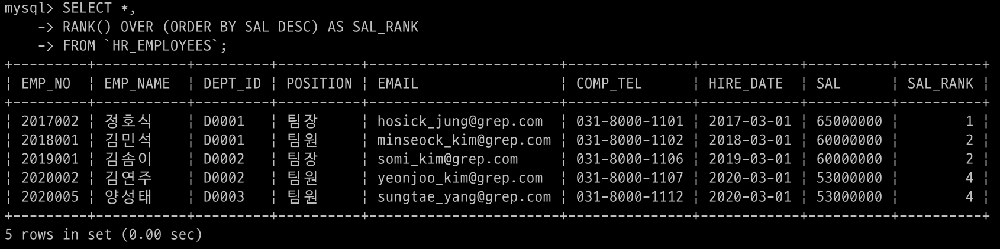
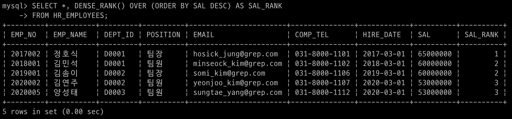

# 순위 함수 (RANK)

## 순위 함수
MySQL 8.0부터 Window함수를 지원하면서 보다 편리하게 순위를 매길 수 있게 되었다. 순위 함수는 Window 함수 중 비집계 함수이며 OVER절과 함께 사용해야 한다. MySQL에서 지원하는 순위함수는 RANK, DENSE_RANK, PERCENT_RANK, ROW_NUMBER 정도가 있다. 

## RANK 
파티션 내 현재 행의 순위를 반환한다. 동점인 경우 동일한 순위를 반환한다. 공동 순위가 존재하는 경우, 다음 순위는 그 수만큼 건너뛰어 매겨진다. (ex. 1,2,2,4)

```sql 
RANK() OVER (
    PRATITION BY <EXPR> [{,<EXPR>...}]
    ORDER BY <EXPR> [ASC|DESC], [{,<EXPR>...}]
)
```
예시 데이터로 급여(SAL)를 기준으로 사원 정보를 내림차순으로 순위를 매겨 나열하면 다음과 같다.

```sql 
SELECT *, RANK() OVER (
    ORDER BY SAL DESC) AS SAL_RANK 
FROM HR_EMPLOYEES;
```
실행 결과 

김민석 팀원과 김송이 팀장이 같은 급여를 받아 공동 순위(2)가 발생했고, 그 다음 순위인 김연주 팀원과 양성태 팀원도 공동 순위(4)로 매겨진 것을 확인할 수 있다.


## DENSE RANK 
파티션 내 현재 행의 순위를 반환한다. 동점인 경우 동일한 순위를 반환한다. 공동 순위가 존재해도 다음 순위는 연속된 값으로 이어진다. (ex. 1,2,2,3...)

```sql 
DENSE_RANK() OVER (
    PARTITION BY <EXPR> [{,<EXPR>...}]
    ORDER BY <EXPR> [ASC|DESC], [{,<EXPR>...}]
)
```
예시 데이터로 급여를 기준으로 사원 정보를 내림차순으로 순위를 매겨 나열하면 다음과 같다.

```sql 
SELECT *, DENSE_RANK() OVER (
    ORDER BY SAL DESC) AS SAL_RANK 
FROM HR_EMPLOYEES; 
```
실행 결과 

김민석 팀원과 김송이 팀장이 같은 급여를 받아 공동 순위(2)가 발생했고, 그 다음 순위인 김연주 팀원과 양성태 팀원도 공동 순위(3)로 매겨진 것을 확인할 수 있다.


## PERCENT_RANK 
PERCENT_RANK는 백분율 순위를 구할 수 있다. 반환 값의 범위는 0에서 1까지이며, 아래 수식의 결과로 계산된 행의 상태 순위를 반환한다.
```sql 
(rank - 1) / (rows -1)
```
수식에서 rank는 행의 순위이고, rows는 파티션 행의 수이다. partition 내의 첫 행은 항상 0을 반환한다. 또한, 동일한 rank에 대해서는 같은 값을 반환한다.

```sql
PERCENT_RANK() OVER (
    PARTITION BY <EXPR> [{,<EXPR>...}]
    ORDER BY <EXPR> [ASC|DESC], [{,<EXPR>...}]
)
```
예시 데이터로 직급(POSITION)별로 사원 정보를 급여 기준으로 내림차순으로 백분율 순위를 매겨 나열하면 다음과 같다. 백분율 순위 값의 소숫점 자릿수는 2가 되도록 반올림한다.(소숫점 셋째자리에서 반올림)

```sql 
SELECT *, ROUND(PERCENT_RANK() OVER(
    PARTITION BY POSITION 
    ORDER BY SAL), 2) AS SAL_RANK 
FROM HR_EMPLOYEES;
```
실행 결과 


## ROW_NUMBER 
파티션 내 현재 행의 수를 반환한다. 행 마다 다른 값을 할당하여, 중복된 값을 반환하지 않 는다. 공동 순위를 허용하지 않고, 정렬 기준이 2개 이상일 때 사용하기 좋다.

```sql 
ROW_NUMBER () OVER (
    PARTITION BY <EXPR> [{,<EXPR>...}]
    ORDER BY <EXPR> [ASC|DESC], [{,<EXPR>...}]
)
```
예시 데이터로 급여 기준으로 사원 정보를 내림차순으로 정렬하되, 급여가 같은 경우 사원 번호를 기준으로 오름차순으로 정렬하면 다음과 같다.

```sql 
SELECT *, ROW_NUMBER() OVER(
    ORDER BY SAL DESC, EMP_NO ASC) AS SAL_RANK 
FROM HR_EMPLOYEES;
```


급여가 같은 김민석 팀원과 김솜이 팀장은 EMP_NO를 기준으로 정렬된다.
마찬가지로 김연주 팀원과 양성태 팀원도 급여가 동일하므로 EMP_NO를 기준으로 정렬된 것을 확인할 수 있다.


> REFERENCE. \
https://passwd.tistory.com/entry/MySQL-%EC%88%9C%EC%9C%84-%ED%95%A8%EC%88%98
